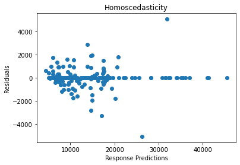
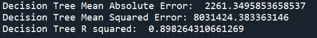
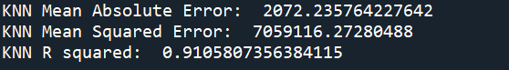

# Using Supervised Machine Learning for Price Predictions

## About

Akashi is a Japanese car company that has recently recovered from a failed attempt to launch vehicles in the US market. During this attempt, sales were low as consumers found the cars to be overpriced. Executives had set price estimates based on previous experience setting prices in the Japanese market. This process relied heavily on unquantifiable intuition and assumed that factors influencing prices in Japan would be the same in the US.

Akashi’s management team has asked you to build a regression model based on a dataset of cars for sale in the American market. Their hope is that they’ll be able to use this model to predict the most appropriate price for the cars they’ll put on the American market.

Skills Showcased

-   Supervised Machine Learning - Decision Trees, KNN, SVR
-   Data Cleaning
-   Feature Engineering
-   Data Analysis

[View more projects like this!](https://cian-murray-doyle.github.io/)

## Libraries Overview

The following Python libraries will be used for this project.

``` python
import pandas as pd
import seaborn as sns
import matplotlib.pyplot as plt
import sklearn.linear_model as skl 
from sklearn.model_selection import train_test_split
from sklearn.tree import DecisionTreeRegressor
from sklearn.neighbors import KNeighborsRegressor
from sklearn.svm import SVR
from sklearn.metrics import mean_squared_error, r2_score, mean_absolute_error
```

## Preparing the Data

Before using the regression models the dataset needs to be prepared. First, we will define our x/predictors and y/response variables.

``` python
response = us_car_prices[["price"]]
predictors = us_car_prices.drop(["price"],axis=1)
```

### Irrelevant Data

Next, we will look at removing features that measure the same or similar metrics, for example, we can drop `"carwidth"` and `"carheight"` and keep `"carlength"`. We can also remove some features that we know will not impact the asking price of the vehicle.


``` python
numeric_columns = us_car_prices.iloc[:,10:]
numeric_columns = numeric_columns.drop(
    ["symboling","stroke","compressionratio","peakrpm",
     "horsepower","carlength","carheight","citympg"],axis=1)
```

With these removed, we can check which of the remaining features, if any, have a high correlation with one another. Using a correlation matrix and plotting it with a heatmap we can see that all of the remaining features are okay to keep. We can drop the features we found to be irrelevant from our `"predictors"` variable at this point.


``` python
predictors = predictors.drop(["symboling","stroke","compressionratio",
                              "peakrpm","horsepower","carlength",
                              "carwidth","carheight","citympg"],axis=1)
```

### Categorical Data

Our linear regression models cannot deal with non-numeric data, to work around this we will convert any categorical data to numeric. In our case, we will use the one-hot encoding method, which will convert each categorical column into two binary columns, one true and one false.

``` python
predictors = pd.get_dummies(predictors,drop_first=True)
```


## Creating the Models

### Linear Regression

Having prepared the data we can begin to create models. The first model we will create is a linear regression model. After we fit the model to our data we will measure the accuracy using R Squared and adjusted R Squared.


As we can see above the model is highly accurate, now we have to check if the model fits the assumptions of linear regression:

-   The data is normally distributed.
-   The data is evenly distributed.

 

As per the above plots, we can see that the data is normally distributed, however, the model was far more likely to provide inaccurate predictions for cheaper cars than for expensive ones. So this model must be rejected.

## Non-Parametric Models

These models will be less accurate than linear regression but they can violate assumptions and still be acceptable to use. We will use three different models to see which proves to be the most accurate.

To begin using these types of models we will need to split our data into training and testing sets, this will help us test the accuracy of our model's predictions.

``` python
predictors_train, predictors_test, response_train, response_test = train_test_split(
    predictors, response, test_size=0.2, random_state=42)
```

### Decision Trees



### K Nearest Neighbours



### Support Vector Regression


We can see from the above scores that the KNN model provides us with the most accurate predictions of car prices. For this reason, we will propose that the firm implement our K Nearest Neighbours algorithm to most accurately predict car prices for the American market.
